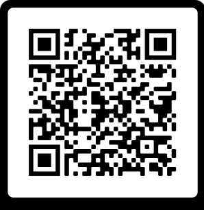

# Folder Tracking App Hatting

## Word List

# Screens

## Authentication Screen

## Home Screen

## Folder Location Screen

## Logging Screen

## Geiger Screen

## Settings Screen

# How to

## Logging Folders to a Location

## Adding & Saving a New Location

## Methods of Logging

## Accepting Logged Folders

## Inventory Mode

## Geiger Search

## Folder Data

## Connecting the RFID Gun
